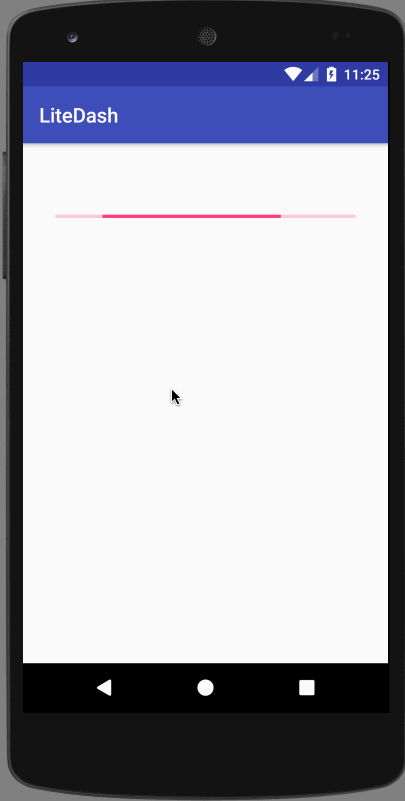

LiteDash
========

This app (`LiteDash`) queries the DoorDash API to render a list of restaurants near a fixed 
location. The user has the ability to mark a restaurant as a _favorite_, which then pushes that
restaurant at the top of the list in the next session.

The implementation of MVP architecture in this app is based on
[googlesamples/todo-mvp](https://github.com/googlesamples/android-architecture/tree/todo-mvp/).

### Screencast


### Installation
The project can be imported into Amdroid Studio and run directly from there: running the `app`
configuration will build and install the app. Alternatively, from the command line, running
this gradle task will also do the same.

````
./gradlew installDebug
````

### Possible Improvements
* Use the device's real location instead of dummy values
* Use real dependency injection framework like Dagger2
* The adapter (`RestaurantCardAdapter`) is not well tested and does not follow MVP closely
* More tests for the data layer and networking layer
* Better abstraction and DI support for the `FavoritesHelper` util, integration with data model
* The network response is not persisted across app restarts: in an offline-first approach,
previously cached data might be shown for a better experience
* Add the ability to pull to refresh using `SwipeRefreshLayout`
* Sort the list of favorites by recency